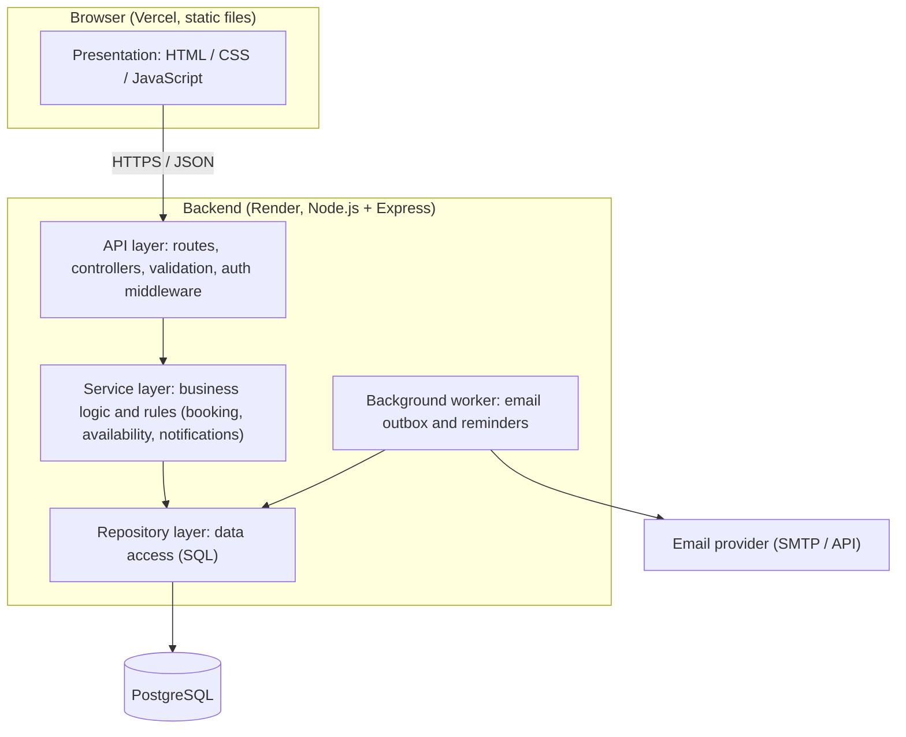
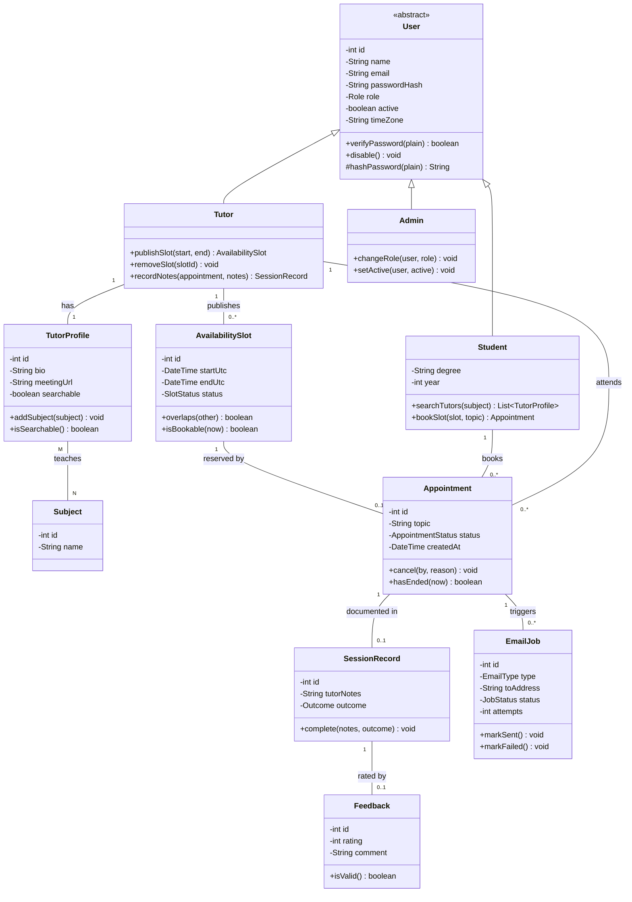
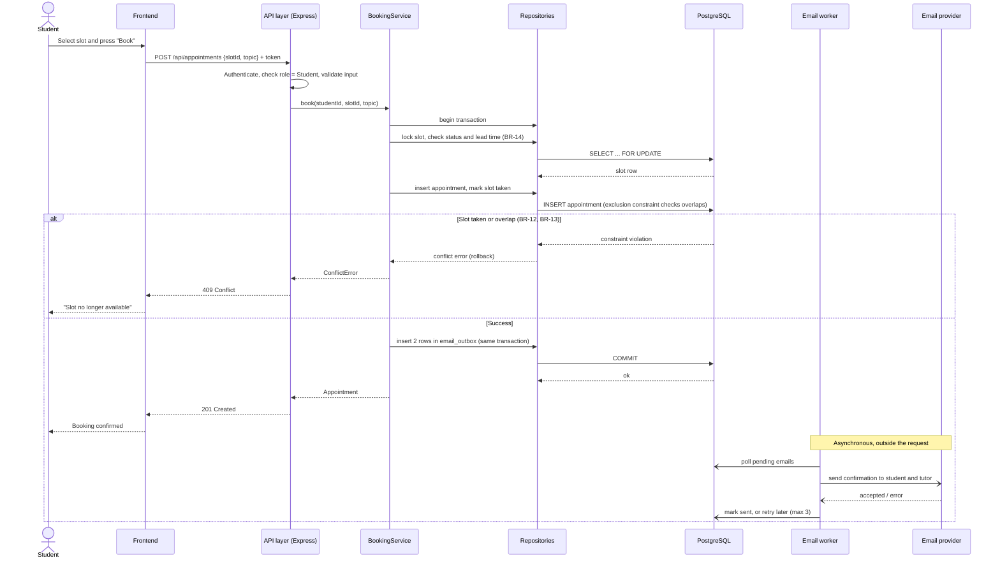
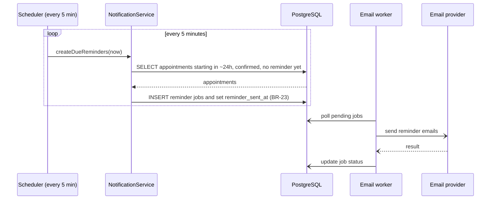
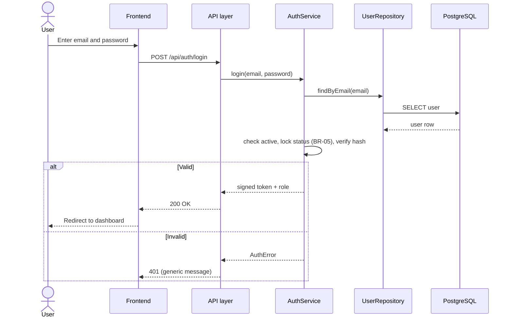
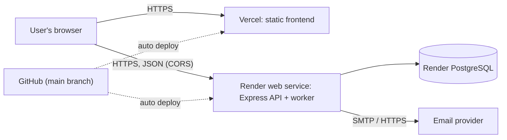

# UniMentor — Phase 1, Section 3: Architectural Design

**Status:** Draft for review in week 5. Diagrams use [Mermaid](https://mermaid.js.org/), which GitHub renders directly. Items marked `[TO CONFIRM]` need a team decision.

---

## 3.1 Architectural Pattern

### Choice: Layered Architecture in a single deployable backend (modular monolith) plus a separate static frontend

The system has two deployable parts:

1. **Frontend**: static HTML, CSS and JavaScript, hosted on Vercel.
2. **Backend**: one Node.js/Express application, hosted on Render, that exposes a REST API and talks to PostgreSQL.

Inside the backend we use four layers. A layer may only call the layer directly below it.



| Layer | Responsibility | May depend on | Must not |
|---|---|---|---|
| **Presentation (frontend)** | Render pages, collect input, call the API | API only (over HTTP) | Contain business rules or know the database |
| **API (routes/controllers)** | Parse requests, validate input, authenticate, authorise by role, map errors to HTTP codes | Services | Contain SQL or business rules |
| **Service** | Business rules (BR-xx): conflict checks, lead times, cancellation rules, notification triggers | Repositories | Know about HTTP (`req`, `res`) |
| **Repository** | Run SQL, map rows to objects, manage transactions | Database driver | Contain business decisions |

### Justification

**How the layers decouple the UI from the database.** The browser never talks to PostgreSQL. It only knows the REST contract (for example `POST /api/appointments`). The contract is the stable boundary: we can rewrite a SQL query, add an index or even change the database without touching the frontend, and we can redesign the screens without touching the data model. Within the backend, only repositories contain SQL, so a schema change is contained in one layer instead of spread through every handler.

**Why this pattern fits the project.**

- *Team size and experience.* Five students with limited experience with calendars need a structure that is easy to understand and to split into tasks (one person on routes, another on repositories). Layering provides clear ownership.
- *Testability.* Booking rules live in the service layer, which has no HTTP dependency, so it can be unit-tested with fake repositories. This directly supports NFR-M2 and the calendar risk in the proposal.
- *Scope.* Core features are CRUD plus one rule-heavy flow (booking). A distributed or event-driven design would add operational cost that the project cannot justify (see ADR-001).
- *Deployment simplicity.* One backend service fits Render's free/low tiers.

**Trade-offs we accept.** Layering adds some boilerplate for simple operations, and a monolith scales as one unit. For a single-university pilot (G5: 50 concurrent users) this is sufficient; if growth required it, services such as notifications could be extracted later because they already sit behind a service interface.

### Asynchronous part

Sending email is slow and can fail, so it is done outside the request. When a booking is created, the service writes a row in an `email_outbox` table **in the same database transaction** as the appointment. A background worker polls the outbox, sends the emails and marks them as sent or retries them. A second job scans for appointments starting in about 24 hours and creates reminder rows. This implements BR-22, BR-23 and NFR-R3 without needing a separate message broker.

---

## 3.2 Domain Model (UML Class Diagram)

Visibility modifiers: `+` public, `-` private, `#` protected. Multiplicities are written on the associations.



Notes on the model:

- **M:N** appears between `TutorProfile` and `Subject` (a tutor teaches many subjects and a subject has many tutors); it is stored in a join table `tutor_subject`.
- **1:N** appears between `Tutor` and `AvailabilitySlot`, `Student` and `Appointment`, and `Tutor` and `Appointment`.
- **1:0..1** between `AvailabilitySlot` and `Appointment` reflects BR-12: a slot has at most one active booking. Cancelled appointments are kept in history, so the database enforces this on *active* appointments only (see 3.5).
- Times are stored in UTC (`startUtc`, `endUtc`) and converted to `User.timeZone` for display (ADR-007).

### Core database tables (summary)

| Table | Key columns | Notes |
|---|---|---|
| `users` | id, name, email (unique), password_hash, role, active, time_zone | Single table for all roles |
| `tutor_profiles` | user_id (PK/FK), bio, meeting_url | One per tutor |
| `subjects`, `tutor_subjects` | subject_id, user_id | M:N join |
| `availability_slots` | id, tutor_id, start_utc, end_utc, status | `tstzrange` exclusion per tutor |
| `appointments` | id, slot_id, student_id, tutor_id, time_range, status, topic | Exclusion constraints prevent overlaps |
| `session_records` | id, appointment_id (unique), tutor_notes, outcome | |
| `feedback` | id, session_record_id (unique), rating, comment | |
| `email_outbox` | id, type, to_address, payload, status, attempts, send_after | Async notifications |

---

## 3.3 Sequence Diagrams

### 3.3.1 Book a session (UC-06) with asynchronous email

The `-)` arrows mean **asynchronous** messages: the sender does not wait for the result.



The student receives the `201` response before any email is sent, so email latency or failure cannot slow down or break a booking.

### 3.3.2 Reminder 24 hours before a session (UC-10)



### 3.3.3 Login (UC-02)



---

## 3.4 Key Design Decisions about the Calendar (main technical risk)

The proposal flags the calendar as the main risk. The design reduces it with four rules:

1. **Store everything in UTC** (`timestamptz`), convert only at the edges. This avoids daylight-saving bugs (NFR-R2).
2. **Let the database enforce conflicts**, not only the application code. Application checks alone have a race condition: two requests can both see the slot as free. A PostgreSQL *exclusion constraint* makes the overlap impossible even under concurrency (ADR-008).
3. **Use fixed, explicit slots** published by the tutor instead of recurring-rule expansion (RRULE) in the first version. It is simpler to reason about and test. Recurring availability is a possible later improvement.
4. **Build the calendar prototype first**, as the proposal's mitigation says: a small module with the slot and booking logic, its tests (including DST dates and concurrent bookings) and no UI, before integrating it in the platform.

---

## 3.5 Architecture Decision Records (ADR)

Each ADR states **Context** (the constraint), **Options considered** (at least two) and **Outcome** (decision and impact).

### ADR-001: Layered modular monolith instead of microservices

- **Context:** A five-person student team, a limited timeline, free/low-cost hosting, and a small user base (one university). The system must be easy to understand, test and deploy.
- **Options considered:**
  1. **Layered monolith** (one backend, four layers).
  2. **Microservices** (separate auth, booking, notification services).
  3. **Serverless functions** per endpoint.
- **Outcome:** Option 1. Microservices add network calls, deployment pipelines and distributed failure modes that the team cannot afford; serverless complicates database connections and local debugging. **Impact:** simple deployment and debugging, easy unit tests of business rules, but the system scales as one unit; the notification worker is kept behind an interface so it can be split off later.

### ADR-002: Node.js with Express for the backend

- **Context:** The proposal fixes JavaScript as the team's language. The backend needs a REST API, JSON handling, and a place for a scheduler/worker.
- **Options considered:**
  1. **Express** (minimal, widely documented).
  2. **NestJS** (opinionated, TypeScript, built-in structure).
  3. **Fastify** (faster, schema-based).
- **Outcome:** Express. It has the lowest learning curve and the most tutorials, and the layered structure is organised by us explicitly. **Impact:** we must enforce the layer rules ourselves (lint rules, code review, NFR-M1) because the framework does not; raw throughput is lower than Fastify but far above the 50-user target.

### ADR-003: PostgreSQL as the database

- **Context:** The data is relational (users, slots, appointments, subjects) and correctness under concurrent writes is critical (G2).
- **Options considered:**
  1. **PostgreSQL** (relational, transactions, range types, exclusion constraints).
  2. **MySQL/MariaDB** (relational, no native exclusion constraints).
  3. **MongoDB** (document store, flexible schema).
- **Outcome:** PostgreSQL. Its `tstzrange` type and `EXCLUDE USING gist` constraint let the database itself reject overlapping bookings, and `SELECT ... FOR UPDATE` supports safe locking. **Impact:** strong integrity guarantees and fewer calendar bugs; requires the `btree_gist` extension and team knowledge of SQL; managed Postgres on Render has limits on its free tier `[TO CONFIRM plan and retention]`.

### ADR-004: Plain HTML/CSS/JavaScript for the frontend (no framework)

- **Context:** The proposal specifies HTML, CSS and JavaScript. The interface has a limited number of screens (login, search, calendar, dashboard, profile, admin).
- **Options considered:**
  1. **Vanilla JavaScript** with a small set of modules and a calendar library.
  2. **React** (component model, larger ecosystem).
  3. **Server-rendered pages** (templates in Express).
- **Outcome:** Vanilla JavaScript with ES modules, plus a lightweight calendar widget library `[TO CONFIRM: e.g. FullCalendar]` for rendering only (all rules stay on the server). **Impact:** no build step and a small learning curve, which matches the stack in the proposal; state management for the calendar is manual and needs discipline, and a later move to a framework would be a rewrite of the UI layer (the API contract would not change).

### ADR-005: Vercel for the frontend and Render for the backend

- **Context:** Free or student-tier hosting is required (NFR-K1). The frontend is static; the backend needs a long-running process for the worker and a managed PostgreSQL.
- **Options considered:**
  1. **Vercel (frontend) + Render (backend + Postgres).**
  2. **A single VPS** (e.g. a small cloud VM) hosting everything.
  3. **Fly.io / Railway** for backend and database.
- **Outcome:** Option 1, as in the proposal. Both have simple Git-based deployment. **Impact:** the frontend and API are on different origins, so CORS must be configured; free Render services can go to sleep when idle, which affects the first request latency and the background worker (NFR-R5, NFR-P1), so the worker design must tolerate restarts and use the database as its queue.

### ADR-006: Token-based authentication (JWT) with role claims

- **Context:** Frontend and backend are on different domains; the API must authorise by role (Student, Tutor, Admin) on every request (NFR-S3).
- **Options considered:**
  1. **JWT** sent in an `Authorization` header or HttpOnly cookie.
  2. **Server-side sessions** stored in the database/Redis with a session cookie.
  3. **Third-party identity provider** (OAuth with the university account).
- **Outcome:** JWT with short expiry, issued by our API and kept in an HttpOnly, Secure cookie `[TO CONFIRM cookie vs header]`; passwords hashed with bcrypt or argon2. **Impact:** stateless API that scales easily and works across origins; immediate revocation (e.g. when an Admin disables a user) needs extra work, so the middleware also checks the user's `active` flag. University single sign-on is a possible later extension.

### ADR-007: Store all times in UTC and convert in the client

- **Context:** The proposal identifies time zones and daylight saving as a risk. Users may be in different zones, and the clocks change twice a year.
- **Options considered:**
  1. **UTC in the database, convert for display** using each user's time zone.
  2. **Local time of the university** stored without zone.
  3. **Store time zone with every record** and compute per row.
- **Outcome:** Option 1, with `timestamptz` columns and an IANA time zone name stored per user. **Impact:** comparisons and overlap checks are unambiguous; conversion code lives in one place and has unit tests around DST dates; every screen and email must format the time in the right zone.

### ADR-008: Database exclusion constraints to prevent double booking

- **Context:** Two students may press "Book" on the same slot at the same moment. Checking availability in application code and then inserting is a race condition (G2, NFR-R1).
- **Options considered:**
  1. **Application-level check only** (SELECT, then INSERT).
  2. **Pessimistic row locking** (`SELECT ... FOR UPDATE` on the slot).
  3. **Database exclusion constraint** on `(tutor_id, time_range)` for active appointments, plus a similar one for `(student_id, time_range)`, combined with option 2.
- **Outcome:** Option 3 (with option 2 for clean error handling). Active appointments are those with status other than `cancelled`; cancelled ones stay in the history without blocking the slot. **Impact:** conflicts are impossible by construction, even if application code has a bug; the service must translate the constraint-violation error into a friendly `409 Conflict`, and tests must call the database directly to prove the constraint.

### ADR-009: Email through an outbox table and a background worker

- **Context:** Confirmations and reminders must be sent, but email providers are slow and can fail, and a booking must never fail because of email (BR-22). Render's free tier can restart or sleep the process.
- **Options considered:**
  1. **Send email synchronously** inside the booking request.
  2. **In-memory queue** (e.g. a library queue in the Node process).
  3. **Outbox table in PostgreSQL** processed by a worker (transactional outbox pattern).
  4. **External message broker** (Redis/RabbitMQ).
- **Outcome:** Option 3. The email job is written in the same transaction as the appointment, so it can never be lost or sent for a booking that rolled back; a worker polls and retries. **Impact:** no extra infrastructure and no lost messages on restart, at the cost of polling delay (a few seconds) and the need to design the worker to be idempotent; a broker can replace the polling later.

### ADR-010: Email provider behind an interface

- **Context:** The free email option may change (SMTP relay, transactional email API with a free tier), and we need to test without sending real email.
- **Options considered:**
  1. **Call the provider SDK directly** from the service.
  2. **An `EmailSender` interface** with an implementation per provider (SMTP via Nodemailer, a transactional API, and a fake for tests).
- **Outcome:** Option 2, starting with Nodemailer over SMTP `[TO CONFIRM provider]`. **Impact:** providers can be swapped by configuration and tests run offline (NFR-R3); one extra abstraction to maintain.

### ADR-011: Versioned SQL migrations

- **Context:** Five developers change the schema and must keep their databases and the deployed one in sync (NFR-M4).
- **Options considered:**
  1. **Manual SQL scripts** run by hand.
  2. **A migration tool** (e.g. node-pg-migrate) with versioned, ordered migration files.
  3. **An ORM with auto-sync** (e.g. Sequelize `sync`).
- **Outcome:** Option 2 with plain SQL migrations, because we rely on PostgreSQL-specific features (range types, exclusion constraints) that ORMs support poorly. **Impact:** reproducible schemas in every environment; the team needs the discipline to never edit a committed migration.

---

## 3.6 Deployment View



Environments: *local* (developer machines with a local PostgreSQL, e.g. through Docker), *staging* `[TO CONFIRM]` and *production*. Configuration comes only from environment variables (NFR-C2).

---

## 3.7 Proposed Project Structure (backend)

```
backend/
  src/
    routes/          # API layer: route definitions, validation, auth middleware
    services/        # business rules: BookingService, AvailabilityService, AuthService...
    repositories/    # SQL access: UserRepository, SlotRepository, AppointmentRepository...
    workers/         # email outbox worker, reminder scheduler
    domain/          # entities and enums (Role, AppointmentStatus...)
    config/          # environment configuration
  migrations/        # versioned SQL migrations
  tests/             # unit (services), integration (API + database)
frontend/
  index.html, css/, js/ (ES modules), pages for login, search, calendar, dashboard, admin
docs/phase1/
```

---

## 3.8 Requirement-to-Design Traceability

| Requirement / goal | Design element |
|---|---|
| G2, BR-12, BR-13, NFR-R1 | ADR-008 exclusion constraints; `SELECT ... FOR UPDATE` in the booking sequence |
| BR-22, BR-23, NFR-R3 | ADR-009 outbox pattern; asynchronous messages in 3.3.1 and 3.3.2 |
| NFR-R2 | ADR-007 UTC storage |
| NFR-S1, NFR-S3, BR-04 | ADR-006 JWT with roles; API-layer middleware |
| NFR-M1, NFR-M2 | Layered architecture (3.1); services testable without HTTP |
| NFR-K1 | ADR-005 Vercel and Render free tiers |
| G3, BR-06 | `TutorProfile` and `Subject` M:N model (3.2) |
| G4, BR-19 | `SessionRecord` and `Feedback` classes |
